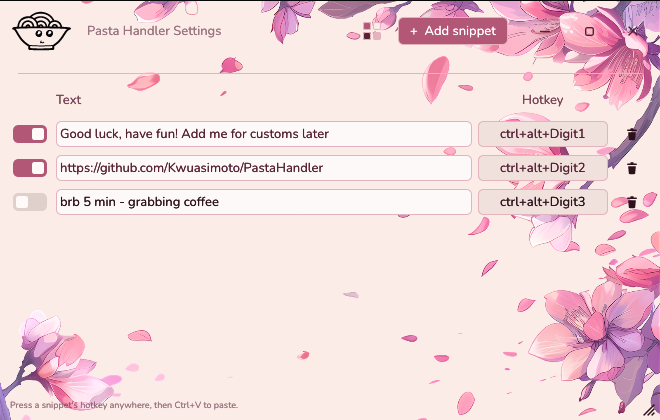
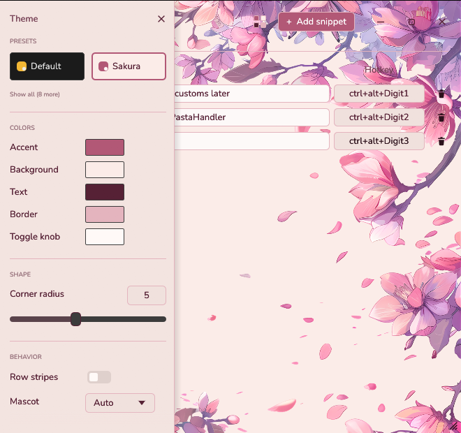

<p align="center">
  
</p>

<h1 align="center">Pasta Handler</h1>

<p align="center">
  Press a hotkey, get your text on the clipboard, <kbd>Ctrl</kbd>+<kbd>V</kbd> anywhere.<br>
  A tiny Windows tray utility for people who paste the same things a lot.
</p>

<p align="center">
  <a href="https://github.com/Kwuasimoto/PastaHandler/releases/latest"></a>
  <a href="https://github.com/Kwuasimoto/PastaHandler/actions/workflows/release.yml"></a>
  <a href="LICENSE"></a>
</p>

<p align="center">
  
</p>

---

## Install

**[⬇ Download the installer](https://github.com/Kwuasimoto/PastaHandler/releases/latest/download/pastahandler-setup.exe)** — run it, done. No admin rights needed (it installs per-user), and this link always serves the newest release.

> **"Windows protected your PC"?** That's Microsoft SmartScreen being cautious about unsigned
> software from small projects. Click **More info → Run anyway**. The installer is built from
> exactly the code in this repository by the [public release pipeline](https://github.com/Kwuasimoto/PastaHandler/actions/workflows/release.yml);
> code signing (which removes the warning) is in progress via SignPath.

After install you'll find two entries in the Start menu:

| Entry | What it does |
|---|---|
| **Pasta Handler** | The tray app — lives next to your clock, listens for your hotkeys |
| **Pasta Handler Settings** | The manager window — snippets, hotkeys, themes |

The tray bowl's menu has everything else: **Open Settings** and **Quit** (which closes the settings window too).

## Make it yours



Click the **swatch button** in the header (the little 2×2 color grid) and the theme drawer slides out:

- **Presets** — ten palettes, each previewed as a card in its own colors: Sakura, Cosmic, Coffee, League, Halo, GoW, and friends. Presets change colors only; your window settings stay put.
- **Colors & shape** — five colors and a corner radius; every other shade in the UI is derived from them, so anything you pick stays cohesive.
- **Window** — go **borderless** (the app draws its own title bar), drop the **opacity** to turn the canvas into glass over your desktop (frosted or sharp — the **Blur** toggle decides), and kill the OS **focus outline** for truly flush edges.
- **Background image** — bring your own PNG with *Browse…*, or press *Example* for the bundled sakura art. The image never fades; opacity only lights the canvas behind it.
- **Mascot** — the bowl comes in dark ink, light ink, or filled. Try hovering it.

Every change applies live and saves automatically. There is no Save button anywhere in the app, on purpose.

<br clear="right">

## Hotkeys

1. **+ Add snippet**, then type the text you want to paste.
2. Click the snippet's **click to set** button and **press your combo** — e.g. <kbd>Ctrl</kbd>+<kbd>Alt</kbd>+<kbd>1</kbd>. It needs <kbd>Ctrl</kbd> or <kbd>Alt</kbd> in it — Shift can join but can't anchor a combo alone (<kbd>Shift</kbd>+<kbd>0</kbd> is just how you type <code>)</code>) — and <kbd>Esc</kbd> cancels.
3. The row's toggle lights up — the hotkey is live *system-wide*, instantly. No restart, no save.
4. Anywhere in Windows: press your combo, then <kbd>Ctrl</kbd>+<kbd>V</kbd>.

Details that matter once you have a few:

- The **toggle** parks a snippet without deleting it.
- Two snippets **may share a combo if only one is active** — alternate texts you switch between.
- Everything lives in a hand-editable TOML at `%APPDATA%\pastahandler\config.toml`; the resident picks up edits within a second, whoever made them. A small diagnostics log sits next to it — errors only, never your snippets or keystrokes.

## Fair play (League of Legends and other games)

Pasta Handler never touches any game: no input simulation, no keyboard hooks, no process access — it only
writes your clipboard when *you* press your hotkey, and *you* press Ctrl+V yourself. The design
rationale against Riot's third-party-software policy is documented in [COMPLIANCE.md](COMPLIANCE.md).
One behavioral note applies to *you*, not the tool: pasting the same link into chat every game can
be reported as spam under Riot's rules. Paste in context, not on cooldown.

## Building from source

```powershell
git clone https://github.com/Kwuasimoto/PastaHandler
cd PastaHandler
cargo build --release          # → target\release\pastahandler.exe
# installer (requires Inno Setup 6):
iscc /DAppVersion=0.0.0-dev installer\pastahandler.iss
```

Dev loop: `.\scripts\dev.ps1` rebuilds and relaunches on every save; <kbd>F12</kbd> in a debug
settings window opens egui's live style editor. Releases are built by CI from a git tag — see
[.github/workflows/release.yml](.github/workflows/release.yml).

## License

MIT (see [LICENSE](LICENSE)) — © Kwuasimoto.
